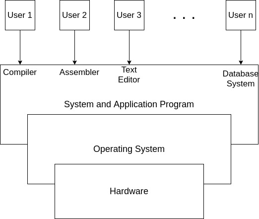
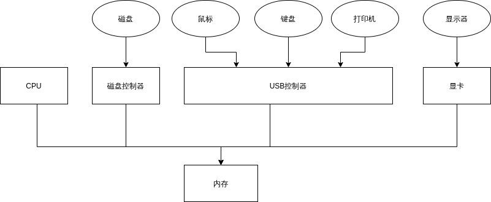
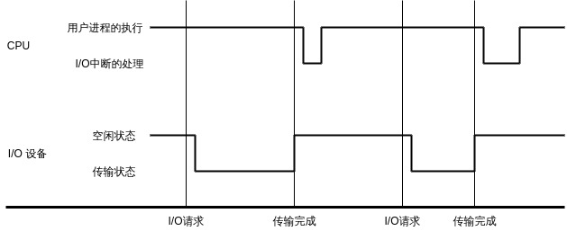
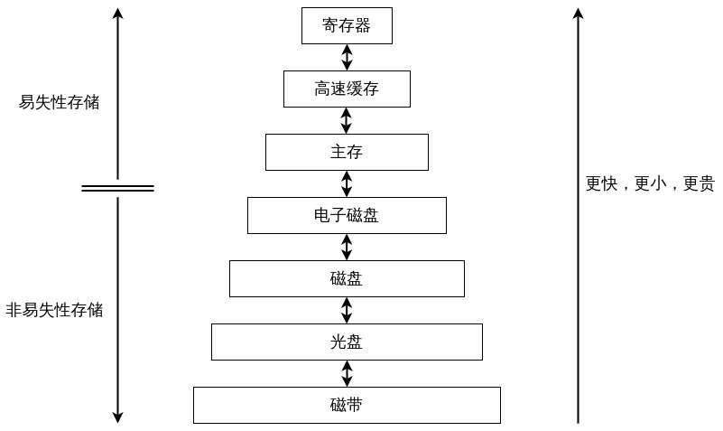
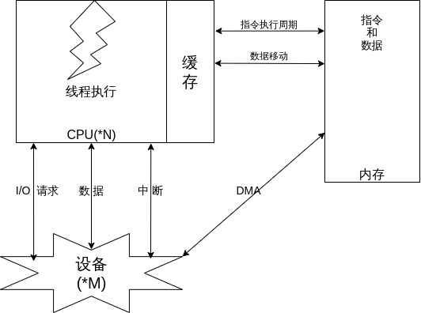
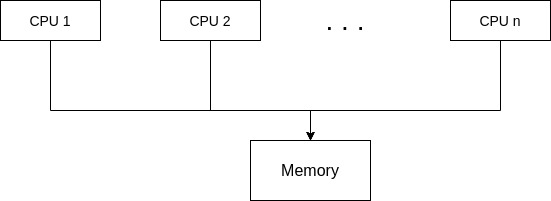
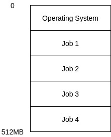
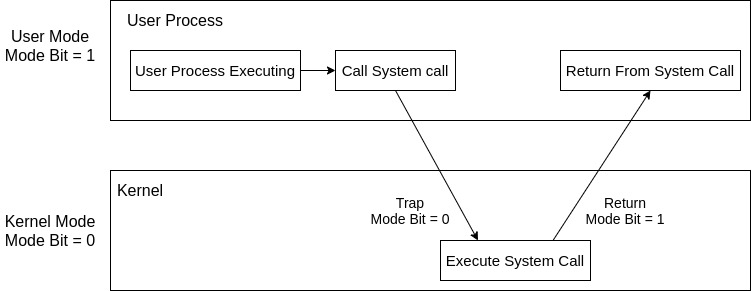

# 1. 导论
## 1.1 操作系统做什么
计算机系统的四个组成部分： **计算机硬件、操作系统、系统程序/应用程序、用户**  
1. 计算机硬件(CPU, Memory, I/O devices) -- 提供基本的计算资源
2. 应用程序 -- 规定了用户使用资源的方式
3. 操作系统 -- 控制和协调应用程序对于硬件的使用  

### 1.1.1 用户视角
1. PC --- 用户使用方便，操作系统主要是为了优化单用户的情况
2. 终端 --- 多用户访问同一台大型机或小型机，操作系统的设计是为了优化资源使用率
3. 工作站 --- 资源使用率和个人使用性能的折中
4. 嵌入式 --- 操作系统的设计是为了无需用户介入，保证机器的自主运行

*PS：资源使用率--确保所有的CPU时间、内存和I/O都被充分使用*

### 1.1.2 系统视角
操作系统是 **资源分配器** 和 **控制程序**

### 1.1.3 操作系统定义
操作系统是一直运行在计算机上的程序（通常称为 **内核**）

## 1.2 计算机系统组织
### 1.2.1 计算机系统操作
现代操作通用的计算机系统是由一个或多个CPU和若干设备控制器通过共同的总线连接而成

1. **固件**: 打开电源或重启的时候，计算机开始运行的一个初始化程序。该 **引导程序** 比较简单，  
位于ROM或者EEPROM中；
2. **中断**: 硬件或软件的中断表征了事件的发生；硬件可以随时通过系统总线向CPU发出信号触发中断  
软件则是通过 **系统调用** 触发中断；中断通过使用中断处理子程序的指针表（中断向量）调用对应的  
中断处理函数。

3. **中断向量**: 中断处理子程序指针表位于内存的低地址处，包含了中断处理子程序的首地址。通  
过唯一的设备号来进行索引

4. 保存现场：中断体系结构也会保存被中断指令的地址，旧的设计是在固定位置上保存中断地址，  
现代的设计是返回系统堆栈中的地址。

5. **系统堆栈** 和 **用户堆栈**: 每个执行中的进程有这两个堆栈，系统堆栈的作用其一是保存中断  
现场，发生嵌套中断的时候，中断信息依次压入堆栈中，中断返回后逆序弹出；其二是保存操作  
系统子程序间相互调用的参数，返回值，返回点以及子程序（函数）的局部变量；用户堆栈的作用  
是保存用户子程序间的相互调用产生的信息。

6. 使用两个堆栈的原因：
	1. 系统栈大小确定并且有限，是由系统的中断优先级个数决定的。
	2. 确保内核态和用户态的隔离保护。
	3. 内核的代码和数据所有进程共享，如果不是每个进程有自己独立的内核栈，无法实现不同进程  
		执行不同的任务；

### 1.2.2 存储结构
1. 内存（ **RAM** ）：通过 **动态随机访问内存(DRAM)** 的半导体技实现，通过一系列的load和store指令来  
   与CPU进行交互，CPU也可以自动从内存中获取数据。内存有以下缺陷无法让程序和数据永远滞留在内存中：
	1. 内存的容量不够大；
	2. 内存是 *易失性存储设备*，掉电后无法保存数据和程序；  
2. 辅存：通过 *非易失性存储设备* 存储程序和数据，在内存上电后将需要的数据拷贝内存中。

### 1.2.3 I/O 结构
现代通用计算机系统由一个CPU和多个 *设备控制器* 组成。每个设备控制器可以负责控制多个特定类型的设备。  
I/O操作的过程中，驱动程序通过在设备控制器中设置特定的寄存器。设备控制器通过获取寄存器的值决定接下  
来的行为。控制器开始从设备向本地缓冲区传输数据。当数据传输完成，会以中断通知的方式告知驱动程序。驱  
动程序返回对操作系统的控制。

1. **设备控制器**：负责其控制的外部设备与本地缓存的数据传递，
2. **DMA(Direct Memory Access)**：面对大量数据移动，以上述的数据传输方式会带来超载的问题。DMA的存在  
	可以在设置好缓冲区、指针和计数器之后，由设备控制器直接控制数据在缓冲区和内存之间的传输。这样  
	减少了中断的次数。

## 1.3 计算机系统体系结构
### 1.3.1 单处理器系统
种类多，主CPU配合其他特定目的的处理器（专用设备处理器）；主CPU执行通用指令集和用户进程的指令，专用  
的设备处理器运行受限的指令集。

### 1.3.2 多处理器系统
1. 多处理器系统（又称为 **并行系统(parallel system)** 或 **紧耦合系统(tightly coupled system)**）的三个优点：
	1. 增加吞吐量：增加处理器的数量来实现更短的时间做更多的事，不过用N个处理器的加速比会比N小。多个CPU
	   同时工作的额外调度会有额外的开销；
	2. 规模经济：多处理器系统通过共用电源供给、外设、大容量存储。会比单处理器系统节省资金； 
	3. 增加可靠性：功能分布在过个处理器的上容错率会比单处理器系统要高，一个处理器的宕机并不会带来毁灭性
	   的灾难；

2. **适度退化(graceful degradation)**：能提供与正常工作的硬件成正比的服务的能力；
3. **容错(fault tolerant)**：超过适度退化的能力；
4. **非对称多处理(asymmetric multiprocessing)**：每个处理器处理特定的任务，一个主处理器控制系统，其他  
	处理器要么向主处理器要任务，要么执行预定工作；
5. **对称多处理(symmetric multiprocessing, SMP)**：每个处理器都需要完成操作系统的所有任务；

6. 新的设计趋势：多处理器芯片，单个芯片上运行多个计算机内核；
7. **刀片服务器(blade server)**：多处理器板、I/O板和网络板全部置于同一底板；

### 1.3.3 集群系统(clustered system)
1. 定义：集群系统也是一种多CPU系统，集中多个CPU完成计算任务。和多处理器系统不同，集群系统是由两个或
   多个独立的系统耦合起来的。
2. **高可用性**：确保即使一个或多个系统出错，服务仍可继续。实现的手段通常是通过在系统中增加一定的冗
   余来获取。
3. **非对称集群(asymmetric clustering)**：一台机器处于 **热备份模式(hot standby mode)**，另外一台服务器
   运行应用程序。热备份服务器监视活动服务器，当发现该服务器失效。热备份服务器会接替完成剩下的任务；
4. **对称集群(symmetric clustering)**：多个主机同时运行应用程序，并且互相监视；
5. 并行集群和WAN集群：并行集群可以允许多个主机访问共享存储的相同数据；
6. **分布式锁管理器(distributed lock manager, DLM)**：确保并行集群对数据的共享访问，系统提供的为文
   件访问的控制和加锁的服务。

***PS:*** *内部连接(InfiniBand)*; ***SAN(storage-area network)***

## 1.4 操作系统结构
1. **多道程序设计**：通过组织job(Code or Data)使得CPU总有一个job是在执行，提高了CPU的利用率。
2. 多道程序设计的思想：操作系统同时在内存中保存多个job，这个Job集合可以是Job Pool的Job子集，操作系
   统选择一个Job去执行，当这个Job必须等待其他Job完成的时候，CPU会切换到内存中的另一个Job去继续执行。  
***PS***：Job Pool是所有需要分配内存和进入系统的Job集合。内存上可以保留的Job个数要比Job Pool的数量少；

3. **分时系统（多任务）**：多道程序设计的延伸，更高频率的在Job之间进行切换，用户可以在程序运行期间
   与之交互；具有分时系统的操作系统允许多个用户共享计算机，分时系统的每个指令都比较短。每个用户只会
   占用少量CPU时间，系统在用户之间快速的切换让每个用户认为整个系统都只为自己所用。
4. **进程(process)**： 装入内存并执行的程序。进程是一个活动的实体。
5. 操作系统的组成（本书的组成）：
	1. **任务调度(Job Scheduling)**
	2. **内存管理(Memory Management)**
	3. **CPU调度(CPU Scheduling)**
	4. **虚拟内存(Virtual Memory)**， **物理内存(Physical Memory)**， **逻辑内存(Logical Memory)**
	5. **文件系统(File System)**
	6. **磁盘管理(Disk Management)**
	7. **资源保护(Resource Protect)**
	8. **任务同步和通信(Job Synchronization and Communication)**
	9. **死锁(DeadLock)**

## 1.5 操作系统操作
### 1.5.1 双重模式操作
1. **陷阱(Trap)或异常(Exception)**：一种软件中断。
2. **用户模式(User Mode)** 和 **系统模式(System Mode)**（又称为 **监视器模式(Monitor Mode)**、 **管理模式(Supervisor Mode)** 或
**特权模式(Privileged Mode)**）。  
3. 通过计算机硬件的 **模式位(Mode Bit)** 来决定是系统模式(0)
4. **特权指令(Privileged Instruction)**：可以引起损害的机器指令
5. 双重模式保护操作系统和用户程序不受错误应用程序影响的实现：在用户模式下试图执行特权指令，硬件不会
   回应这个请求。而是将其视为非法操作通过陷阱的形式告知操作系统。

### 1.5.2 定时器
1. **定时器(Timer)** / **可变定时器(Variable Timer)** 的意义：
	1. 防止用户程序陷入死循环或不调用系统服务，不将控制权返回给操作系统。
	2. 确保操作系统对CPU的控制。
2. 操作系统设置计数器，在一个时钟周期后，计数器递减。计数器减为0时产生中断。
3. 操作系统在将控制权交给用户程序的时候通过设置定时器以便产生中断。

---
> 1.6 ~ 1.12 内容是对后面章节的内容进行了简单介绍，在后续章节会有更详细的讲述，这里就不赘述了 
