# 2. 操作系统结构
多个角度研究操作系统：
1. 操作系统所提供的服务；
2. 操作系统为用户和程序员提供的接口；
3. 操作系统各个组成部分及其相互关系；

## 2.1 操作系统服务
> 操作系统提供给用户很有用的特性：
1. **用户界面(User Interface, UI)**： **命令行界面(Command-Line Interface, CLI)**， **图形用户界面
   (Graphical User Interface, GUI)**
2. **程序执行(Program Execution)**
3. **I/O 操作(I/O operations)**
4. **文件系统操作(File-system manipulation)**
5. **通信(Communications)**
6. **错误检测(Error Detection)**
7. **资源分配(Resource Allocation)**
8. **统计(Accounting)**
9. **保护和安全(Protection and Security)**

## 2.2 操作系统的用户界面
### 2.2.1 命令解释程序
> 略
### 2.2.2 图形用户界面
> 略

## 2.3 系统调用
**系统调用(system call)** 提供了接口来获取操作系统的有效服务。通常由C/C++实现，对于需要直接访问硬件  
的任务可能会以汇编指令的形式提供。

#### 1. 使用系统调用的例子

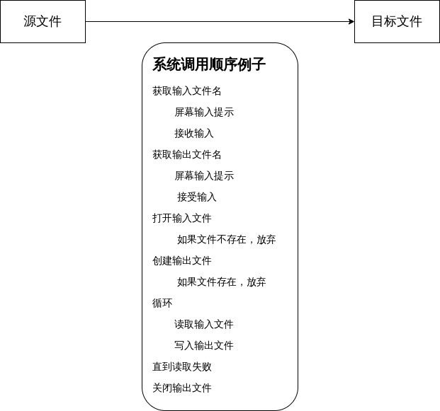

#### 2. 应用程序接口(API)
API 是一系列适用于应用开发者的函数接口，包括了传递给每个函数的参数以及返回开发者想要的值。组成API的  
实际函数通常为应用开发者调用实际的系统调用。使用API的好处：
1. 提高程序的可移植性
2. 对应用开发者来说，调用API要比系统调用来的容易

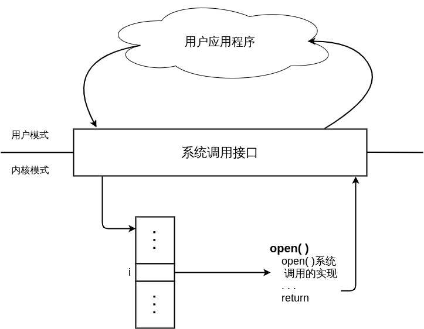

#### 3. 向操作系统传递参数的三种方式
1. 参数通过寄存器传递；
2. 参数作为内存块或表来通过寄存器传递；
3. 参数通过堆栈传递：程序将参数压入堆栈，操作系统弹出；

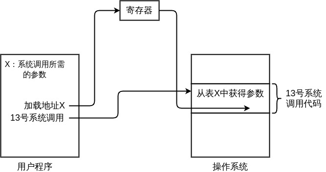

*PS*：函数传参的三种方式：
1. 按值传递
2. 地址传递
3. 引用传递

## 2.4 系统调用类型
五大类： **进程控制、文件管理、设备管理、信息维护和通信**
1. 进程控制
	1. 结束、放弃
	2. 装入、执行
	3. 创建进程、终止进程
	4. 取得进程属性、设置进程属性
	5. 等待时间
	6. 等待事件、唤醒事件
	7. 分配和释放内存
2. 文件管理
	1. 创建文件、删除文件
	2. 打开、关闭
	3. 读、写、重定位
	4. 取得文件属性、设置文件属性
3. 设备管理
	1. 请求设备、释放设备
	2. 读、写、重定位
	3. 取得设备属性、设置设备属性
	4. 逻辑连接或断开设备
4. 信息维护
	1. 读取时间或日期、设置时间或日期
	2. 读取系统数据、设置系统数据
	3. 读取进程、文件或设备属性
	4. 设置进程、文件或设备属性
5. 通信
	1. 创建、删除通信连接
	2. 发送、接受消息
	3. 传递状态消息
	4. 连接或断开远程设备

**补充：** 无论是进程间的通信，还是网络上的通信。其实所有的通信都是基于两种方案来实现的：  
**消息传递模型(message-passing model)** 和 **共享内存模型(shared-memory model)**。
1. 消息传递：通信双方必然是知道对方的存在。读和写都是之间通知到对方。好处就是这种方案的通信，可以获
   取数据只有通信的双方，安全性相比第二种要高。
2. 共享内存：通信双方约定一块大家都知道的内存，生产者写内存，消费者读内存。这个时候，生产者不一定了
   解消费者的存在，两者之间也没有实际意义上的连接。这样的好处是通信的时间和效率更高，但是无法保证数
   据的安全性。

## 2.5 系统程序
1. **文件管理**
2. **状态信息**
3. **文件修改**
4. **程序语言支持**
5. **程序装入和执行**
6. **通信**

## 2.6 操作系统设计和实现
### 2.6.1 设计目标
1. 在最高层，系统设计受到硬件选择和系统类型的影响：批处理、分时、单用户、多用户、分布式、实时或通用目标。
2. 两个基本类：用户目标和系统目标。
	1. 用户要求体现在明显的系统特性：易用、易上手、可靠、安全和快速。
	2. 系统目标体现在易维护、灵活、可靠、高效以及不会出错。

### 2.6.2 机制和策略
**策略(policy)** 和 **机制(mechanism)** 是在设计操作系统的时候一个重要的原理。机制决定如何做，原理决定做什么。

## 2.7 操作系统结构
### 2.7.1 简单结构
*MS-DOS* 和 *UNIX* 的系统结构因为是在早期设计的，面对现如今的操作系统需求，这两者的设计也必然是落后的

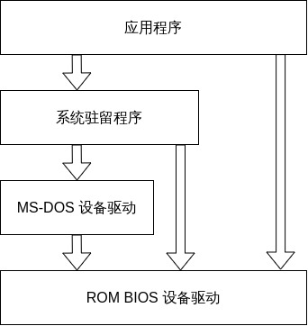

### 2.7.2 分层方法
操作系统最底层（层0）是硬件，最高层（层N)是用户接口。好处是构造和调试的简单化。
1. 每层都是通过较低层所提供的接口和功能来实现的。
2. 分层法的主要难点在于对每层的详细定义，每一层只能使用其下的较低层。
3. 分层法相比其他方法的效率较低。

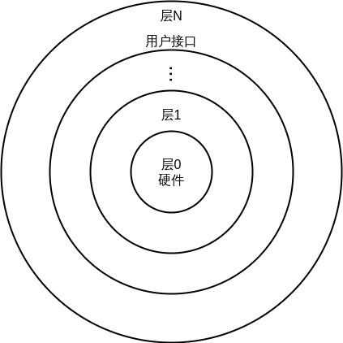

### 2.7.3 微内核
**微内核(MicroKernel)** 模块化内核，将非基本部分均移除内核。微内核主要功能是使客户程序和运行在用户空间
的各种服务进行通信。
1. 好处在于方便系统的扩充，新的功能实现均在用户空间完成。
2. 相对的，微内核也必须忍受系统功能总开销的增加带来的系统性能的下降

### 2.7.4 模块化
最新的操作系统设计方式是通过 **面向对象编程技术** 生成模块化的内核。内核有一组核心组件，在启动或运
行时对附加服务动态链接。Eg：Solaris 操作系统被组织为7个可加载的内核模块围绕一个核心内核组成：
1. 调度类；
2. 文件系统；
3. 可加载的系统调用；
4. 可执行格式；
5. STREAMS 模块；
6. 杂项模块；
7. 设备和总线驱动；

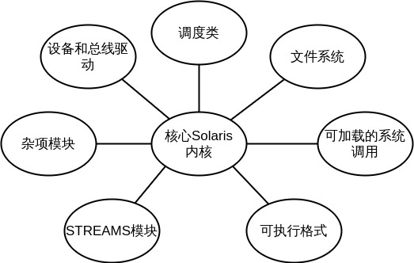

这种方法类似于微内核，不过相比微内核更加高效，因为不需要用消息传递来进行通信。苹果的Mac OS X操作系
统采用的是一种混合结构。上层包括了应用环境和图形接口服务，下层的内核环境包括了Mach微内核和BSD内核。 
Mach提供内存管理、RPC 和 IPC，包括消息传递和线程调度。BSD提供了BSD命令行接口，支持网络和文件系统，
以及POSIX API的实现，包括Pthread。与此同时，内核环境为设备驱动的开发和动态加载模块提供了I/O工具。

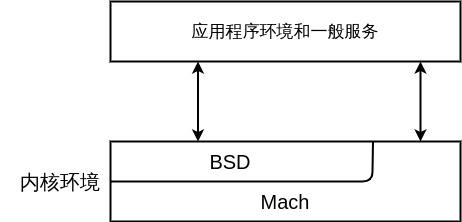

## 2.8 虚拟机

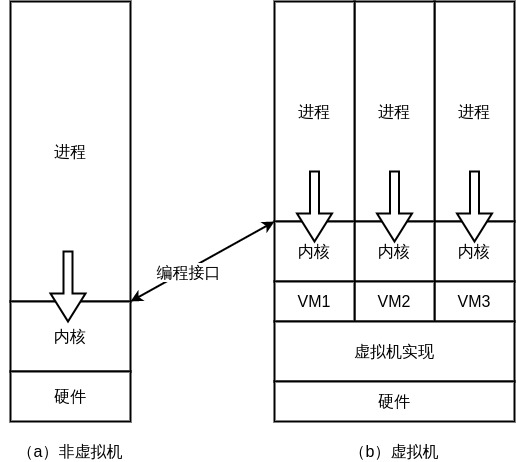

### 2.8.1 实现
因为实际的物理机由两种工作模式：用户模式和内核模式。所以对于虚拟机来说也需要由两种工作模式：  
*虚拟用户模式* 和 *虚拟内核模式*。在实际物理机上引发模式转换的动作，也需要在虚拟机环境下引起模式转换。  

*实现思路*： 当在虚拟用户模式下执行的应用程序发生系统调用的时候，会在真实的物理机上触发到虚拟机监视
器的转换。虚拟机监视器通过改变虚拟机的寄存器内容和程序计数器来模拟系统调用的效果。从而完成切换模式
的操作。

### 2.8.2 优点
1. 每个虚拟机都是完全独立的，所以可以保护通不过的系统资源。并且没有安全问题。虚拟机之间数据共享的方
   式由两种：一、共享小型磁盘来共享文件；二、定义一个虚拟机网络，通过网络实现文件共享。
2. 虚拟机系统可以更方便的用于研究和开发操作系统；虚拟机系统可能基本上让 **系统开发时间** 减到最小；

### 2.8.3 实例
1. VMware

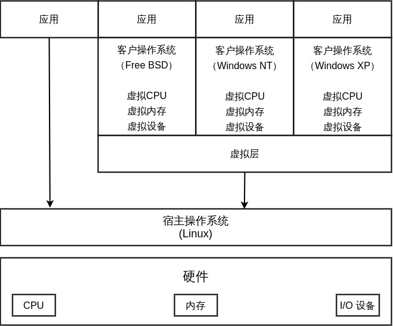

2. **JAVA 虚拟机(JVM)**  
JVM 是一个抽象的计算机规范。包含 **类加载器** 和 Java 解释器，JVM 通过 **垃圾回收(garbage collection)** 
来实现内存自动管理。JVM 的内存自动回收算法也成了提升性能的重中之重。

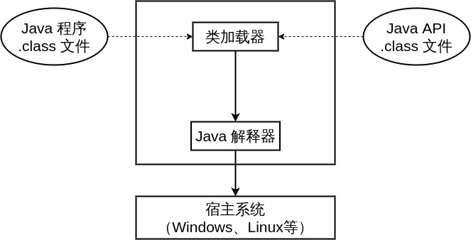

3. **JIT(just-in-time)**  
JIT 即时编译器，JVM 通过判断某段代码的执行频率来决定是将代码编译成机器码还是Java的字节码。其中字节
码由 JVM 解释执行。机器码可以直接执行，由此可以看出Java是一个半解释半编译的语言。

4. **.NET 框架**  
.NET 框架是一套包含了类库集合、执行环境和软件开发平台的技术。可以让用户基于.NET框架进行编程而不是针
对某个特殊平台。.NET的运行环境对于中间细节进行了抽象提供了一个介于底层体系结构和应用程序之间的虚拟机。

> .NET 的核心以及虚拟机实现是 **公共语言运行库(CLR)**。用C#或者VB.NET编写的代码被编译成一种平台无关的
> 中间语言 **(MSIL 微软中间语言/CIL 公共中间语言)**。和Java类似的是，.NET也采用了JIT 即时编译器和垃圾
> 回收的内存自动管理机制。

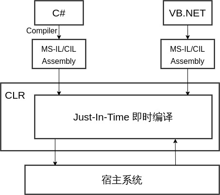
