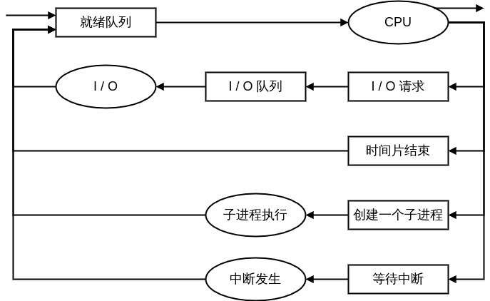

# 3. 进程
## 3.1 进程概念
*作业(Job)* 和 *进程(Process)* 是用于描述同一概念的两个名词。

### 3.1.1 进程
> 进程是执行中的程序。

进程是一个动态的概念，他不仅仅包含了 **文本段(代码段/.text)**。进程同时包含了 **程序计数器** 和 
CPU寄存器共同表征的当前的活动。最后，进程还包括了 **堆栈段(stack)**（临时数据，如函数参数、
返回地址和局部变量）、 **数据段(.data)**（全局变量）、 **堆(heap)**（动态内存分配）。  

*PS：* 程序是 ***被动实体***，一段存放在磁盘上的代码；进程是 ***活动实体***，除了代码还包含运行过程
中的相关资源的集合。  


### 3.1.2 进程状态
根据进程当前的活动状态，给出进程可能出现的几种状态如下：（这里的状态是通用的一种说明，实际操作系统
的区分可能会更加细致）  
1. **New (新的)**：进程正在被创建；
2. **Running (运行中)**：进程的指令正在执行；
3. **Waiting (等待)**：进程等待相关事件的发生（I/O操作完成或者收到信号）；
4. **Ready (就绪)**：进程等待被分配处理器；
5. **Terminated (终止)**：进程完成执行，结束任务；

这些状态对应的图例如下图所示：  


### 3.1.3 进程控制块 
进程在操作系统中通过 **进程控制块(Process Control Block, PCB)**。PCB 中包含以下信息：  


1. **进程状态**：具体的状态信息参见 3.1.2 节；
2. **程序计数器**：计数器表示了进程下一条待执行的指令的地址；
3. **CPU寄存器**：不同的计算机体系结构对应的寄存器数量和种类不同，可能包含了累加器、索引寄存器、堆
   栈指针、通用寄存器、和其他条件码信息寄存器。需要在中断的时候保存以便恢复现场时可以正常运行；
4. **CPU 调度信息**：进程优先级、调度队列的指针和其他调度参数；
5. **内存管理信息**：使用的内存基址和界限寄存器的值、页表或者段表；
6. **记账信息**：CPU 时间、实际使用时间、时间界限、记账数据、作业或进程的数量；
7. **I/O 状态信息**：I/O 设备列表、打开的文件列表。


### 3.1.4 线程
> 略

## 3.2 进程调度
**进程调度** 就是选择一个可用的进程（可能从多个可用进程集合中选择）。

### 3.2.1 调度队列
1. **作业队列**：进程进入系统之后，就会加入工作队列；
2. **就绪队列**：驻留在内存中就绪的，等待运行的进程位于就绪队列。就绪队列通过链表实现，其中它的头结
   点指向链表的第一个和最后一个PCB块的指针；
3. **设备队列**： 等待特定I/O设备的进程列表称为设备队列；


**队列图(Queueing Diagram)** 是用于表示进程调度的常用方法。长方形表示队列，圆形代表队列服务的资源。
下图是通过队列图表示进程从就绪队列开始的调度分配的几种情况：  



#### Linux系统中的进程
Linux中的进程PCB的实现是一个C语言的结构体：task_struct。这个结构中包含了一个进程需要的全部信息。其
中的部分字段如下：
```c
/* 详细的结构体内容参考Linux源码中的：include/linux/sched.h */
pid_t pid;						/* porcess identifier */
long state;						/* state of the process */
unsigned int time_slice;		/* scheduling information */
struct file_struct *files;		/* list of open files */
struct mm_struct *mm;			/* address space of this process */
```
Linux 通过 **current** 这个全局指针表示当前进程。

### 3.2.2 调度程序
1. **调度程序(scheduler)**：用于选择执行的进程的程序。 
2. **长期调度程序(Long-term scheduler)或作业调度程序(Job Scheduler)**：从缓冲池中选择进程装入内存中。
3. **短期调度程序(Short-term scheduler)或CPU调度程序**：从就绪队列中选择进程，为之分配CPU；
4. 长期调度程序决定了 **多道程序设计的程度(内存中进程的数量)**，稳定的多道程序设计可以保证创建进程
   的平均速度等于进程离开系统的平均速度。
5. 长期调度程序设计过程中的选择尤其重要，需要平衡I/O为主的进程和CPU为主的进程的组合，从而维持整个系
   统的平衡。
6. 对于有些系统如UNIX和Windows并没有长期调度程序。所有的调度工作由短期调度程序来完成，系统稳定性依
   赖于用户的使用习惯和物理限制（可用的终端数目）
7. **中期调度程序(Medium-term scheduler)** 是一种类似于内存swap的调度机制，允许进程从内存中换出和换
   入。


### 3.2.3 上下问切换
**上下文切换**：将CPU 切换到另一个进程需要保存当前进程的状态并恢复另一个进程的状态，这一任务即是上下文切换。

## 3.3 进程操作
### 3.3.1 进程创建
1. 进程在执行过程中可以通过系统调用来创建多个新的进程，其中创建进程称为 **父进程**，新的进程称为 **子进程**。
2. 进程需要一定资源来完成任务。子进程创建时，可能从操作系统直接获取资源，也可以只从父进程获取资源。
   为了防止进程过多带来系统超载，所以限制子进程只能使用父进程的资源。子进程除了进程父进程的物理和逻
   辑资源以外，还接受从父进程传入的初始化数据。
3. 进程创建的时候，父进程的两种可能：
	1. 父进程与子进程并发；
	2. 父进程等待子进程执行完毕；
4. 新进程的地址空间也有两种可能：
	1. 子进程完全继承父进程的程序和数据；
	2. 子进程装入另一个新的程序；

### 3.3.2 进程终止
1. 父进程终止子进程的原因：
	1. 子进程使用了超过它所分配到的资源，（父进程存在检查子进程状态的机制）；
	2. 分配给子进程的任务已经不再需要；
	3. **级联终止**：父进程终止后，子进程不允许继续进行（只有部分系统(eg. VMS)存在这种特性）；
2. 在UNIX类系统中，当父进程终止，会将init进程作为其所有子进程的新父进程。

## 3.4 进程通信
1. 进程 **协作**（存在数据共享的进程） 的理由：
	1. **信息共享(Information Sharing)**
	2. **提高运算速度(Computation Speedup)** 
	3. **模块化(Modularity)** 
	4. **方便(Convenience)** 

2. 协作进程进行通信的两种基本模式： **共享内存** 和 **消息传递**；


### 3.4.1 共享内存系统
共享内存通信需要通信进程建立共享内存区域(驻留在生成共享内存段进程的地址空间)。
1. 生产者-消费者问题（共享固定大小缓冲区的两个进程在实际运行过程中会面对的问题）：
	1. 无限缓冲(Unbounded-Buffer)：生产者无需等待，缓冲区为空时消费者需要等待；
	2. 有限缓冲(Bounded-Buffer)：生产者在缓冲去满时需要等待，缓冲区为空时消费者需要等待；
	3. 生产者-消费者问题需要关注的重点是两个进程的同步问题；

2. 需要开发者自己实现和访问共享内存空间。

### 3.4.2 消息传递系统
消息传递系统允许进程不必共享地址空间来实现同步和通信，这在分布式环境中是十分必要的。不过消息传递系
统有两种必要的操作：发送和接收。针对这两种操作，有两点需要说明：
1. 由进程发送的消息可以是定长或变长的，定长的系统实现简单；变长的编程任务简单。这是需要权衡的选择；
2. 两个进程需要通信就必须存在 **通信线路**，物理的通信线路可能是：共享内存、硬件总线或者网络等。逻
   辑实现的线路和send() / receive()操作的方法：
	1. 直接或间接通信；
	2. 同步或异步通信；
	3. 自动或显式缓冲；

#### 命名
##### 直接通信
***1. 对称寻址方案***  
直接通信要求每个进程必须明确的命名通信的接收者和发送者。这种方案场景下，原语 send() 和 receive()定义如下：
1. send(P, message); 发送消息给进程P
2. receive(Q, message); 接收来自进程 Q 的消息

这种对称寻址的方案，具有如下属性：
1. 在需要通信的每对进程间自动创建通信线路。进程仅需知道相互通信的标识符；
2. 一个线路只与两个进程有关；
3. 每对进程之间只存在一个线路；

***PS: 什么是原语？？？***  
这里提到send() 和 receive() 的时候有一个名词称之为原语( **Primitives** )，那么原语的定义又是什么？这里摘录
了百度百科的定义：

> 原语通常由若干条指令组成，用来实现某个特定的操作。通过一段不可分割的或不可中断的程序实现其功能。原语
> 是操作系统的核心，它不是由进程而是由一组程序模块所组成，是操作系统的一个组成部分，它必须在管态（一种
> 机器状态，管态下执行的程序可以执行特权和非特权两类指令，通常把它定义为操作系统的状态）下执行，并且常
> 驻内存，而个别系统有一部分不在管态下运行。原语和广义指令都可以被进程所调用，两者的差别在于原语有不可
> 中断性，它是通过在执行过程中关闭中断实现的，且一般由系统进程调用。许多广义指令的功能都可用目态(一种机
> 器状态，通常把它作为用户程序执行时的状态)下运行的系统进程完成，而不一定要在管态下完成，例如文件的建立、
> 打开、关闭、删除等广义指令，都是借助中断进入管态程序，然后转交给相应的进程，最终由进程实现其功能。引进
> 原语的主要目的是为了实现进程的通信和控制。

从定义中可以看到有以下几点关键信息：
1. 原语是操作系统实现的可以被进程调用的一种系统调用；
2. 原语操作不可以被中断，并且运行在内核态；

***2. 非对称寻址方案***  
非对称寻址即为只要求发送者命名接收者，接收者无需命名发送者。这种方案场景下，原语 send() 和 receive()定义如下：
1. send(P, message); 发送消息给进程P
2. receive(id, message); 接收来自任何进程的消息，变量id设置为与其通信的进程名称

不论是对称寻址还是非对称寻址，都极大的限制了进程定义的模块化。改变了进程名称可能必须检查其他所有进
程的定义。这种标识符必须明确指出的 **硬编码** 技术使用的较少。

##### 间接通信
间接通信要求两个进程之间通过邮箱或者端口来发送或者接收消息，邮箱具有一个唯一的标识符（POSIX 的消息队列采用一个
整数值标识邮箱）。这种方案场景下，一个进程可以通过不同的邮箱与进程进行通信。两个进程在至少共享同一个邮箱的前提
下才可以相互通信。原语send() 和 receive() 定义如下：
1. send(A, message); 发送一个消息到邮箱 A
2. receive(A, message); 接收一个来自邮箱 A 的消息

间接通信线路具有如下属性：
1. 两个进程共享同一个邮箱的时候，才能建立通信线路；
2. 一个通信线路可以与两个或者多个进程进行关联；
3. 两个进程之间可以有多个邮箱，每个邮箱对应一个线路；

**思考：三个进程P1、P2、P3共享邮箱A。P1执行send，P2和P3都执行receive。最终哪个进程可以收到消息**  
实际上这个取决于实际采用的通信方案：
1. 允许一个线路最多与两个进程相关联。 *此时这种场景无法存在*
2. 一次最多允许一个进程执行receive操作。 *receive操作是互斥的，此时P2和P3会先后接收到消息取决于谁先
   抢到receive*
3. 允许系统通过算法来选择一个进程接收消息，并向发送者标识接收者。 *此时的结果取决于操作系统的算法实
   现*

邮箱可以是进城所有也可以是操作系统所有。当进程持有邮箱的时候，需要区分邮箱的持有者（只允许接收消息）
以及邮箱的使用者（只允许发送消息）。邮箱的生命周期也随着拥有者进程的结束而结束。当操作系统持有邮箱
的时候，邮箱独立存在不依附于任何进程。此时操作系统需要提供必要的机制确保进程可以完成如下操作：
1. 创建新的邮箱；
2. 通过邮箱发送或者接收消息；
3. 删除邮箱；

创建邮箱的进程是默认的拥有者，通过系统调用可以将邮箱的拥有权和使用权传递给其他进程。

***思考：共享内存和进程持有邮箱的区别？？？***  
共享内存和进程持有邮箱，都存在与一个进程的地址空间内。并且都是一个进程可以读取，另一个进程可以发送。
那么两者的区别又是什么？这里个人的理解如下：
1. 访问共享内存的两个进程必须同在一个操作系统环境下，而进程持有的邮箱允许分布式系统的不同进程进行访
   问。
2. 共享内存的实现原理，生成共享内存段的进程会将一段自己进程空间内的内存设置为共享内存段。其他进程如
   果需要访问这段内存空间需要将共享内存段附加在自己的进程空间内。邮箱可以抽象成一个对象，并具有唯一
   的标识符。

#### 同步
消息传递可以是 **阻塞** 或 **非阻塞** --- **同步** 或 **异步**：
1. 阻塞send --- 发送进程阻塞，直到消息被接收进程或邮箱接收。
2. 非阻塞send --- 发送进程发送消息并再继续后续操作。
3. 阻塞receive --- 接收进程阻塞，直到有消息可以被接收。
4. 非阻塞receive --- 接收进程收到有效消息或者是空消息。

#### 缓冲
1. **零容量**：没有缓冲的消息传递系统。不允许消息等待，必须阻塞发送。
2. **有限容量**：自动缓冲，允许有限的消息数据驻留队列中，队列未满的时发送者不必等待。队列满的时候，
   必须阻塞发送者
3. **无限容量**：自动缓冲，从不阻塞发送者

## 3.5 IPC 系统的实例
> 略

## 3.6 客户机－服务器系统通信
### 3.6.1 Socket（套接字）
1. Socket 可以定义为一种通信的端点，一对通过网络通信的进程需要使用一对Socket，即每个进程都拥有一个。
2. Socket 的组成是由IP 地址和端口号连接而成。
3. Socket 分为三种基本类型（以Java 的Socket 通信为例，C/C++ 类似）： *面向连接(TCP)*、 *无连接(UDP)*、
	*多点传送(MulticastSocket class，允许多个接收者)*
4. Socket 通信交换的是无结构的字节流；

### 3.6.2 远程过程调用 (RPC)


### 3.6.3 远程方法调用 (RMI)
Java 中类似于 RPC 的一种特性，允许线程调用远程对象的方法。RPC 和 RMI 在两方面有根本的不同：
1. RPC 支持子程序编程，即只能远程调用子程序或函数；RMI 基于对象的，它可以支持远程调用对象。
2. RPC 传递的参数是数据结构；RMI 传递的参数可以是对象。
