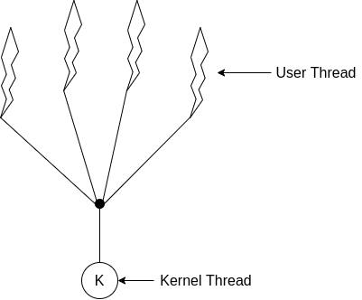

# 4. 线程
## 4.1 概述
传统单线程进程和多线程进程的区别：

### 4.1.1 动机

**场景**：一个应用程序需要执行多个相似的任务。单个线程执行，客户需要等待很长的处理时间；创建多个进程
又非常的消耗时间和资源。

**需求**：我们既然需要创建多个相似的任务，又何必不停去创建进程。所以，线程在设计和实现过程中是共享
部分资源的，如同上图所示。

### 4.1.2 优点
1. **响应度高**
2. **资源共享**
3. **经济**
4. **多处理器体积结构的利用**

## 4.2 多线程模型
线程的支持分为两个层面：用户层的 **用户线程**、内核层的 **内核线程**；用户线程和内核线程也必然存在
一种对应关系。

### 4.2.1 多对一模型
1. **定义**：将多个用户线程映射到一个内核线程，线程管理由用户空间的线程库进行。
2. **优势**：效率高。
3. **缺陷**：如果一个线程阻塞了系统调用，那么整个进程都将阻塞。多个用户线程也无法在多处理器上进行并发。

### 4.2.2 一对一模型
1. **定义**：将每个用户线程映射到一个内核线程。
2. **优势**：相比多对一模型更好的并发功能，也能运行在多处理器上。
3. **缺陷**：每创建一个用户线程需要对应创建一个内核线程，会影响用户程序性能；限制了系统支持的线程数
   量。

### 4.2.3 多对多模型
1. **定义**：多路用户线程复用了同等数量或更小数量的内核线程（内核线程的数量决定于特定的应用程序或者
   特定机器）。
2. **优势**：没有了一对一和多对一的缺陷，既能保持并发；开发人员也可以创建任意数量的用户线程。
3. **变种**：二级模型，在允许多对多模型的基础上，也支持用户将特定用户线程绑定到某个内核线程上。

## 4.3 线程库
1. **定义**： **线程库(Thread Library)**为程序员提供了创建和管理线程的API。
2. **实现**：两种方法可以实现线程库 --- 在用户空间提供一个没有内核支持的线程库、操作系统支持的内核级的库
3. **三种主要的线程库**：
	1. ***POSIX Pthread***：Pthread 作为POSIX的扩展可以提供用户级和内核级的线程库；
	2. ***Win32***：Win32线程库是适用于Windows操作系统的内核级线程库；
	3. ***Java***：Java 的线程API 允许在Java 应用程序中创建和管理线程，API 的具体实现取决于JVM 的宿
	   主的线程库；

## 4.4 多线程问题
### 4.4.1 系统调用 fork() 和 exec()
1. 当一个线程调用了fork() 的时候，新的进程是应该复制所有线程，还是新的进程只有单个线程？有的UNIX系
   统存在两种形式的 fork()。一种复制所有线程，一种只复制调用了fork()的线程。
2. 当一个线程调用 exec() 的时候，exec() 参数中指定的程序会替换整个进程，包括所有线程。
3. 如果一个线程在fork() 后立即调用了 exec()，此时没有必要复制所有线程。因为exec() 指定的程序会替换
   整个进程。如果fork() 没有立即调用exec()，那么另一个进程会复制所有线程。

### 4.4.2 取消
**线程取消**：在线程完成之前终止线程的任务；要对一个目标线程进行线程取消有以下两种途径：
1. **异步取消(Asynchronous Cancellation)**：一个线程立即终止目标线程；
2. **延迟取消(Deferred Cancellation)**：目标线程不断检查自己是否应终止；
3. 如果目标线程正在更新与其他线程共享的数据，此时异步取消并不能让系统资源得到释放。此时延迟取消的优
   势就得到体现，这会允许目标线程可以在一个安全的点被取消。

### 4.4.3 信号处理
**信号**的通用模式：
1. 信号是由特定事件的发生所产生的；
2. 产生的信号要发送到进程；
3. 一旦信号发送，必须对其加以处理；

信号的处理函数分为： **默认信号处理程序(Default Signal Handler)**、 **用户定义的信号处理程序**；  
单线程场景下，信号总是发给进程；但是多线程场景下，信号的处理方式有如下的选择：
1. 发送信号到信号所应用的线程；
2. 发送信号到进程内所有线程；
3. 发送信号到进程内的某些固定线程；
4. 规定一个特定线程来接收信号。

具体的信号处理方式取决于信号的类型，同步信号发送到产生信号的线程；异步信号的情况就比较复杂；  

Windows的信号支持工作是通过 **异步过程调用(Asynchronous Procedure Call，APC)**来进行模拟，所以在
Windows中不再需要像 UNIX 一样处理多线程场景下的信号处理。APC 模拟的信号只会发给特定线程。

### 4.4.4 线程池(Pthread Pool)
**线程池(Pthread Pool)** 通过在进程开始的时候创建一定数量的线程放入池中等待工作。当需要的时候，从池
中唤醒一个线程进行工作。工作完成之后，线程也会回到池中等待下次的工作。

***优点：***
1. 加快了线程处理请求的速度，因为不需要在每次处理请求的时候执行线程创建的工作；
2. 线程池限制了可用线程的数量，对于一些不支持大量并发线程的系统变得尤为重要；

Win32 和 Java 都有特定的 API 来创建和管理线程池。

### 4.4.5 线程特定数据
同属一个进程的线程共享进程的数据，不过在某些场景下，线程需要一定的私有数据。我们称之为 ***线程特定
数据(Thread Specific Data)***；  

Win32、Pthread 以及 Java 都有对线程特定数据进行支持 。

### 4.4.6 调度程序的激活
***内核线程和用户线程通信的必要性：***在上文中我们提及了多种用户线程和内核线程的对应模型。需要理解的一点
是内核可以调度管理的，以及可以使用物理层面的处理器的只是内核线程。我们只是通过映射关系将用户线程和
内核线程对应起来，这种映射关系的建立也势必会带来一个问题的考量：如果让内核线程和用户线程进行通信，
这里的通信一方面指的是在多对多模型和二级模型的场景，我们需要动态调整内核线程数量来最大化性能表现，
这其中就涉及了内核线程和用户线程对应关系重新建立的问题。其次就是当内核线程阻塞的时候，我们也需要存
在一种机制来告知用户线程它当前的状态。

为了实现两者的通信，许多系统选择在内核和用户线程之间实现一种中间的数据结构（通常都是 **轻量级进程(LWP)**），
其中 LWP 和内核线程是一一对应的，基于 LWP 实现的内核和用户线程通信的方法是 **调度器激活(Scheduler Activation)**。

其工作原理：（这里的 LWP 在英文原文中指的的Virtual Processor）  
内核给用户程序一组的 LWP 让其调度自己的线程到一个可用的 LWP 上。而内核将特定事件告知用户程序的过程
被称为 ***upcall***。内核的upcall则是交由具有 ***upcall 处理句柄*** 的线程库进行处理。upcall的处理句柄运行在LWP
之上。当用户线程即将被阻塞，内核触发一次 upcall 通知用户有线程要被阻塞以及对应的线程标识。然后内核
分配一个新的 LWP 给应用程序，应用程序在这个新的 LWP 上运行 upcall 的处理句柄。处理句柄在新的 LWP 的
主要工作内容是保存阻塞线程的状态，并放弃运行阻塞线程的 LWP。当阻塞线程等待的事件发生时，内核通过另
外一个upcall通知应用程序先前阻塞的线程可以继续运行。这个事件的 upcall 处理句柄也会申请一个 LWP。内
核会选择分配一个新的 LWP 或者抢占一个用户线程的 LWP 运行先前被阻塞的线程。
