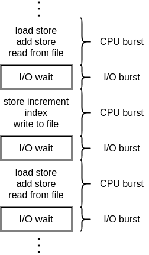
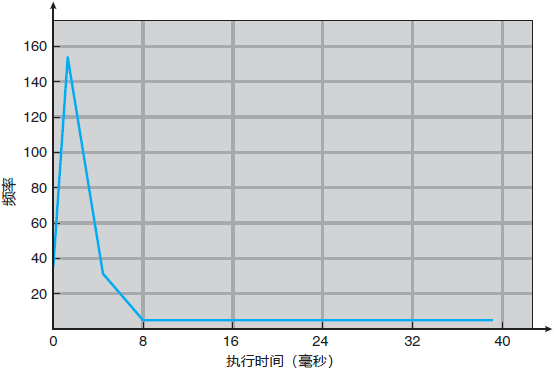

# 5. CPU 调度
## 5.1 基本概念
CPU 调度的根本目的是为了最大化CPU的利用率，在一个进程必须等待的时候释放 CPU。
### 5.1.1 CPU-I/O 区间周期
CPU 调度的前提是保证当前进程是可以调度的。一个进程是可以调度的需要有以下两点属性：
1. 进程执行包含了 CPU 执行和 I/O 等待。
2. 进程在这两个状态之间进行切换。

CPU 区间的长度已经大量测试过，不论进程和计算机的变化。它变化的频率曲线都是类似的指数或者超指数形式
，具有大量的短 CPU 区间和长 CPU 区间，I/O 约束程序具有较多的短 CPU 区间、CPU 约束程序具有少量的长
CPU 区间。根据分布情况可以很好的选择 CPU 的调度算法。

### 5.1.2 CPU 调度程序
从就绪队列中选择进程的工作是由 **短期调度程序(Short-Term Scheduler)** 或者 CPU 调度程序来完成的。就
绪队列的实现并不局限于 *先进先出(FIFO)队列*。还可以通过 *优先队列*、 *树*、 *简单的无序链表* 来实现。队
列中的成员通常是 **进程控制块(PCB)**。

### 5.1.3 抢占调度
CPU 调度的发生场景主要是以下 4 种情况：
1. 一个进程由运行状态转为等候状态 (Switch From Running state to Waiting state)；
2. 一个进程由运行状态转为就绪状态 (Switch From Running state to Ready state)；
3. 一个进程由等待状态转为就绪状态 (Switch From Waiting state to Ready state)；
4. 一个进程终止的时候 (Process Terminate)；

其中，只存在第一种和第四种情况的方案是 **非抢占的(Nonpreemptive)** 或 **协作的(Cooperative)**。否则
则称这种方案是 **抢占的(Preemptive)**。抢占调度是十分复杂的，需要考虑非常多的情况：
1. 抢占调度需要特别的硬件（如定时器）的支持。
2. 抢占调度需要考虑共享数据访问时候的时序问题。
3. 抢占调度对于内核设计的时候需要考虑在进程修改重要内核数据的时候的不可抢占的保护问题。

### 5.1.4 分派程序
**分派程序**的功能主要包括：
1. 切换上下文
2. 切换到用户模式
3. 跳转到用户程序的合适位置，以重新启动程序

分派程序需要保证 **尽可能的快**。 分派程序停止一个进程而启动另一个进程的延迟也被称为 **分派延迟(Dispatch Latency)**。
所以分派程序的设计重点就是要求分派延迟要足够的短。

## 5.2 调度准则
- **CPU 使用率**：真实系统的 CPU 使用率在 40% ～ 90%；
- **吞吐量**： 一个时间单元内完成进程的数量；
- **周转时间**：从进程提交到进程完成的时间段；
- **等待时间**：在就绪队列等待所花费的时间；
- **响应时间**：提交请求到第一响应的时间；

**准则就是：最大化 CPU 使用率和吞吐量；周转时间、等待时间以及响应时间最短**

## 5.3 调度算法
### 5.3.1 先到先服务算法 (First-Come First-Served Scheduling, FCFS)
FCFS 算法是一种非抢占的最简单的 CPU 调度算法。先请求 CPU 的进程先分配到 CPU。可以通过 FIFO 队列轻松实现。

**缺点：**  
1. 进程平均等待时间较长。当进程的 CPU 区间时间变化很大，那么平均时间的变化也就取决于进程的顺序，通
   常 CPU 区间时间较短的进程排在前面的时候，或获得更短的平均等待时间。
2. **护航效果(Convoy Effect)**：大量进程等待一个长时间占用 CPU 的进程释放。

### 5.3.2 最短作业调度算法 (Shortest-Job-First Scheduling, SJF)
SJF 算法是将进程与其下一个 CPU 区间段相关联。CPU 空闲的时候，它会赋给最短 CPU 区间的进程。如果两个
进程的具有相同的长度，则通过 FCFS 算法来调度。SJF 算法既可以是抢占的也可以是非抢占的，抢占的 SJF 
算法也被称为 **最短剩余时间优先算法(Shortest-Remaining-Time-First Scheduling)**。SJF 算法可以被证明是
最佳的算法，不过难点在于无法获取进程的下一个 CPU 区间的时间。所以无法在短期调度中使用。不过可以通过
数学的方式 *预测* 来获取下一个 CPU 区间。一般认为下一个 CPU 区间时间是以前 CPU 区间时间的 **指数平均**。即

$$\tau_{n+1} = {\alpha} t_{n} + (1 - {\alpha})\tau_{n}$$

其中，$t_{n}$表示最近信息，$\tau_{n}$代表了过去历史，参数$\alpha$控制了最近和过去历史在预测中的权重。

### 5.3.3 优先级调度 (Priority Scheduling)
优先级调度指的是每个进程都有一个优先级与其相关联。高优先级的进程会首先分配到 CPU，相同优先级的进程
通过 FCFS 顺序来进行调度。上文提到的 SJF 是一种优先级调度的特例，这里的优先级就是下一个 CPU 区间的
倒数。优先级的定义可以通过内部或外部方式来实现，内部方式比如时间极限、内存要求、平均 I/O 区间与平均
CPU 区间之比等等；外部的方式比如计算机的费用类型和数量、赞助商等等。 *优先级可以是抢占的也可以是非抢
占的*。  

***优先级调度存在的主要问题***：  
**无穷阻塞(Indefinite Blocking) / 饥饿(Starvation)**：优先级调度算法可能会让一个低优先级的进程无穷的
等待 CPU。解决无穷阻塞的方法之一就是 **老化(Aging)**。通过随着时间增加在系统中等待时间较长的进程的
优先级来避免低优先级进程被无穷阻塞。

### 5.3.4 轮转法(Round-Robin, RR)调度
轮转法是专门为分时系统设计的一种类似于 FCFS 调度的调度算法。不同的是，相比 FCFS，RR调度算法增加了抢
占以切换进程。通过定义一个进程可以执行时间的较小单元，称之为 **时间片(Time Quantum / Time Slice)**。CPU
调度算法循环就绪队列为每个进程分配不超过一个的时间片的 CPU。如果有一个进程分配的时间片超过一个的时
候，当其运行完第一个时间片后就会被抢占。进程本身进行就绪队列等待下次执行的机会。  

轮转法性能考量的关键在于时间片大小的选择。如果时间片选择过大，RR 算法就退化成了 FCFS；如果时间片选
择过小，那么 RR 算法称为 **处理器共享**。可以看做$n$个进程都有自己的处理器，速度是真正处理器的 $1/n$，
进程上下文的切换需要的时间一般小于$10\mu s$，时间片的选择一般在$10$ ~ $100 ms$。 **根据经验，$80\%$
的CPU区间应该小于时间片**。

### 5.3.5 多级队列调度算法(Multilevel Queue Scheduling Algorithm)
多级队列调度指的是：当进程可以比较容易的区分为不同组的情况下，可以将就绪队列按照进程的属性分为多个
独立的队列。可以考虑队列之间存在绝对的优先级顺序或者不同的队列拥有不同的 CPU 时间的划分、不同的队
列也可以采用不同的调度算法。

### 5.3.6 多级反馈队列调度算法(Multilevel Feedback Queue Scheduling Algorithm)
前文中的多级队列调度算法是不允许进程转移队列的，因为进程的属性并不会改变。这样虽然减少了调度开销但
是缺乏灵活性。多级反馈队列调度算法允许进程在不同的队列之间移动。主要的思路是通过消耗 CPU 区间的时间
长度不同来建立不同的队列。当进程需要过多的 CPU 时间时，就会转移到更低优先级的队列之中。较低优先级队
列中等待较长时间的进程也有机会转移到高优先级队列中。  

多级反馈队列的定义使得它称为最通用的 CPU 调度算法，不过它还需要一些方法来选择参数以获得最佳的调度算
法，以下是多级反馈队列调度程序需要的参数：  
1. 队列数量
2. 每个队列的调度算法
3. 升级更高优先级队列的方法
4. 降级更低优先级队列的方法
5. 确定进程进驻哪个队列的方法

## 5.4 多处理器调度
### 5.4.1 多处理器调度的方法

**对称多处理(Symmetric MultiProcessing, SMP)** 和 **非对称多处理(Asymmetric MultiProcessing)**

### 5.4.2 处理器亲和性
为了尽可能保证一个进程只在一个处理器上运行的性质即为 **处理器亲和性**。处理器亲和性分为两种实现方式：
1. **软亲和性(Soft Affinity)**：操作系统尽可能让一个进程保持在同一个处理器上，但是不作出任何承诺。也就是
	说进程依旧有可能在处理器之间移动。 

2. **硬亲和性(Hard Affinity)**：操作系统提供系统调用，从而允许进程指定它的处理器，并且不会移动到其
   他处理器上。

### 5.4.3 负载均衡(Load Balancing)
负载均衡的目的是为了确保在 SMP 系统中，多个处理器的负载平衡，从而完全发挥多处理器的优势。实现负载均
衡通常有两种方法：  
1. **Push Migration**：由一个特定的任务检查每个处理器的负载，并将超载处理器的进程推送到空闲处理器上。
2. **Pull Migration**：由空闲处理器从超载处理器上获取(Pull)一个等待进程，来减轻超载处理器的负担。

Pull 和 Push 不能相互排斥，两种行为通常是并行实现的。负载均衡通常会抵消掉亲和性的优势。

### 5.4.4 对称多线程
对于多个物理处理器的 SMP 系统是可以允许同时运行多个线程。同时我们也可以选择提供多个逻辑处理器达到相
同的效果。这种技术称之为 **对称多线程(SMT)**，Intel 称之为 **超线程(Hyperthreading)**。需要注意的是 SMT 是由
硬件提供的，而不是软件提供的。SMT 的主要思想就是在同一个物理处理器上生成多个逻辑处理器，每个逻辑处
理器都有自己的 **架构状态**。

## 5.5 线程调度
**竞争范围**：
1. **进程竞争范围(Process-Contention Scope, PCS)**：线程库调度用户级线程到一个有效的 LWP 上运行。
2. **系统竞争范围(System-Contention Scope, SCS)**：系统调度内核级线程到一个物理 CPU 上运行。

## 5.7 算法评估
1. **确定模型(Deterministic Modeling)**： **分析评估法(Analytic Evaluation)** 和 **确定模型法(Deterministic Modeling)**
2. **排队模型(Queueing Models)**： **排队网络分析(Queueing-Network Analysis)** 就是将计算机系统描述
   为服务器网络获取到进程的到达率和服务率，从而计算调度算法的平均吞吐量、利用率和等待时间等。
   > Little 公式：$n =\lambda \times W$，其中$n$是平均队列长度、$W$是队列平均等待时间、$\lambda$是平均到
   > 达率。适用于任何调度算法和到达分布。
3. **模拟(Simulations)**
4. **实现(Implementation)**
